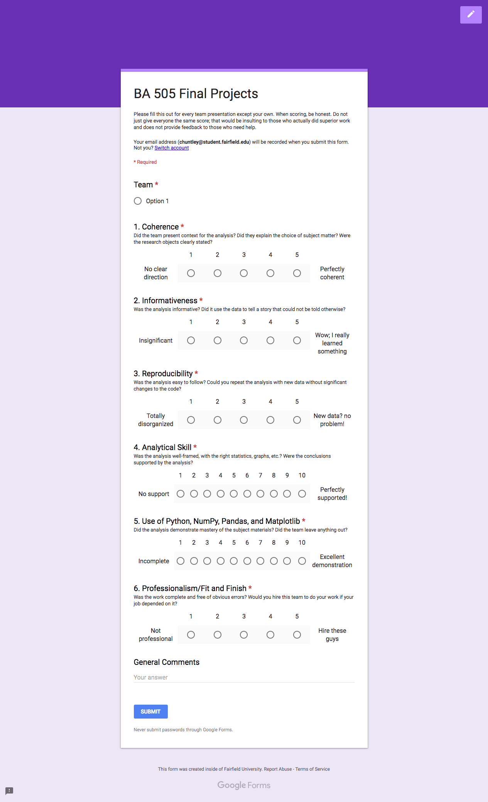

## December 4, 2018
1. Faculty Candidate
    - [Feedback form](https://docs.google.com/forms/d/e/1FAIpQLSchEtiJPcrj3DaFUVVnzwCrzWcu1Ooc-hRpSqTIP8VTlOAiMw/viewform?usp=sf_link)
2. Term project
    - Each team: take 3 minutes to preview the project for the rest of the class
    - Use the rest of class to work on your analysis
    - Take a peek at the form below to get an idea of how grades will be assessed. Design your presentation accordingly to get the best results.

[GitHub Pages Link](https://christopherhuntley.github.io/ba505-docs/Agenda/)

