# Part 2: Working with Dirty PDF and CSV Files.
## Issues Covered
* Unstructured text and PDFs
* Common problems with ill-formatted (i.e., non-relational) CSV files 
* Code reuse and reproducible analyses

## Practices Demonstrated
* Scraping tabular data from PDF files with [Tabula](https://tabula.technology/)
* Use of a custom module to make code reusable
* Defensive programming: preventing bugs *before* they happen
* Decomposition into modules to simplify logic and improve testability

## Preliminaries: Scraping PDFs with Tabula
__1. First, let's experience the unique challenge of pulling data from PDF files.__  
Take a look at the Fairfield University's [Spring 2018 Undergraduate Course Booklet](201801CourseBooklet.pdf). You'll see lots of pseudo-tabular text, where data is organized into rows and columns. However, when you try to copy text from a table like this ...
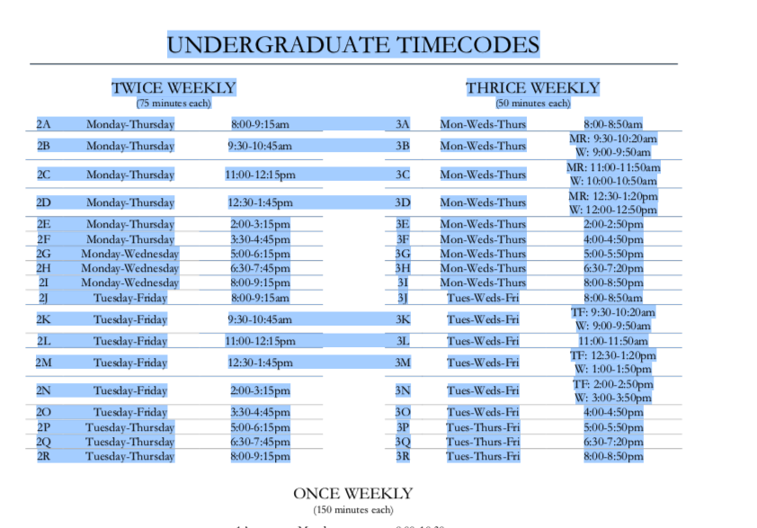  
and then paste it into a text file you get this:  
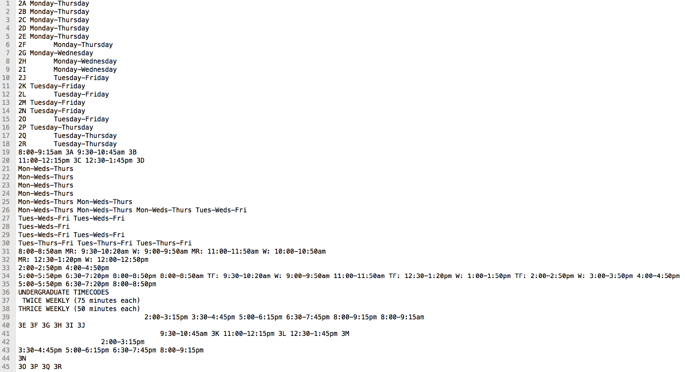  
Whoah, where'd the table go? Why is everything all jumbled? The dirty little secret of PDF files is that they are actually designed to minimize the work of displaying printed pages, not for us to use as data. The order in which the text is stored in the file is irrelevant as long as the physical location on the page is known. As far as PDF writers care, text is just shapes on a page. So, it's kind of random where everything ends up within the physical PDF file.

__2. In this exercise we are going to extract data from the course booklet into a CSV file and then clean it up using standard Python.__  
For the first part we are going to use [Tabula](https://tabula.technology/), which promises to be just the right tool for the job:
> **How Can Tabula Help Me?**    
If you’ve ever tried to do anything with data provided to you in PDFs, you know how painful it is — there's no easy way to copy-and-paste rows of data out of PDF files. Tabula allows you to extract that data into a CSV or Microsoft Excel spreadsheet using a simple, easy-to-use interface. Tabula works on Mac, Windows and Linux.
>
>**Who Uses Tabula?**    
Tabula is used to power investigative reporting at news organizations of all sizes, including ProPublica, The Times of London, Foreign Policy, La Nación (Argentina), The New York Times and the St. Paul (MN) Pioneer Press.
>
>Grassroots organizations like SchoolCuts.org rely on Tabula to turn clunky documents into human-friendly public resources.
>
>And researchers of all kinds use Tabula to turn PDF reports into Excel spreadsheets, CSVs, and JSON files for use in analysis and database applications.

**So why do we need Python if Tabula creates CSV files?** Even with all of the smarts Tabula provides, it still has to make a lot of guesses about the structure of the original table, the most problematic of which is picking out the column breaks. In PDFs there are no tabs or spaces. Those are just whitespace between characters. So, is a given bit of whitespace long enough to indicate a new column or is it just a normal space within the column text? It's almost impossible to tell sometimes and Tabula sometimes gets it wrong. The resulting CSV files may then have extra commas (column separators) in some places and be missing commas in others. Unfortunately for us, even one misplaced or missing comma can totally ruin our CSV file, so we have to clean the CSV before we can use it in our analyses. Fortunately, we the analysts (presumably) know what the original table was about and can usually make corrections manually. Or, better yet, use Python to do it for us. We just have to encode the correction rules and let Python do the rest.  

### You are encouraged to install and try out Tabula as shown below. 
Doing is always better than watching. While you may get slightly different results, it will certainly help to visualize what Tabula is doing for you and how it might help you with your projects. 

__3. Tabula is a Java-based installable web app.__  
The app requires a recent version of Java to install. Once installed it operates as a (fairly spare but functional) web app on your `localhost` (i.e., a web server running on your computer), just like JupyterLab.
  
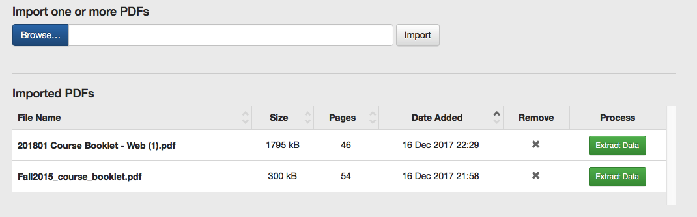  

__4. Importing a PDF and Extracting Data.__  
From the main screen you can `Import` a PDF file on your hard drive and then `Extract Data`. Tabula will open the file and invite you to Select Tables.
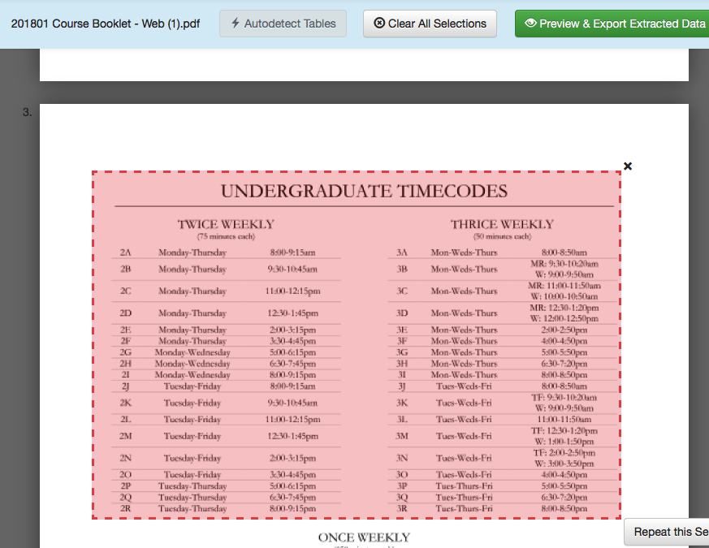  
Select each table you want to scrape by dragging out boxes with your mouse. Or, if you prefer, let Tabula Autodetect the tables for you and then correct any erroneous selections yourself.    

In our case the tables we want start on page 13 of the printed booklet:
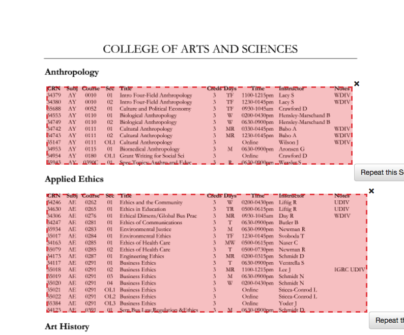  
It seems to be doing a decent job, though (as we'll see) it has problems when tables span page breaks. With a bit of fiddling with the selections, however, you can get it mostly right. It certainly beats retyping it yourself.  

Once the tables have been selected, use the Preview and Export Extracted Data to generate a CSV file. 
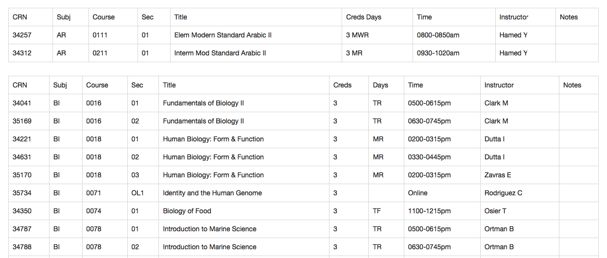  
Oops, it looks like we found a bad column break. Can you spot it? Hmmm.  

Let's export to CSV and then fix it ourselves. 
  
Before moving on, take a moment to study the finished [tabula-201801CourseBooklet.csv](https://github.com/christopherhuntley/ba505-docs/blob/master/Tutorials/CourseCatalogDemo/tabula-201801CourseBooklet.csv) file.

## Source Data Definition and Assessment
__1. Column Definitions. All are text except where noted.__  
- __`CRN`__: the course reference number for the section of the course; `CRN` is unique, retired from use for future offerings
- __`Subj`__: the subject area for the course (e.g., "BA" for Business Analytics)
- __`Course`__: The course number within the subject area (e.g., "0505"); note that course "numbers" are not actually numbers and can contain text codes
- __`Sec`__: the section ID for the class; within each semester each class section has a distinct `Sec`
- __`Title`__: the course title, which is usually drawn from the course catalog but can be customized for a specific section
- __`Creds`__: the number of course credits; like `Course` there may be text mixed in (e.g., "1-3")
- __`Days`__: the days of the week that the course meets (e.g., "TF" means Tuesdays and Fridays); exceptions like "online" classes that don't meet at all or "by appointment" only classes are marked accordingly.
- __`Time`__: the meeting time for the course, typically in `<start time>` - `<end time>` format; time is left blank when the class is online or the time is unknown`
- __`Instructor`__: the instructor name(s); the names are unique for any given semester (and possibly unique thereafter)
- __`Notes`__: a list of special designations like 'WDiv' with meanings explained in the course catalog

__2. Bug Detection.__ 

All things considered, Tabula did a greate job of capturing the data, but there were a few bus we'll need to address before we can use the data:
- __In the very first line of the file, the `Creds` column is merged with the `Days` column. This is repeated elsewhere throughout the file.__ 
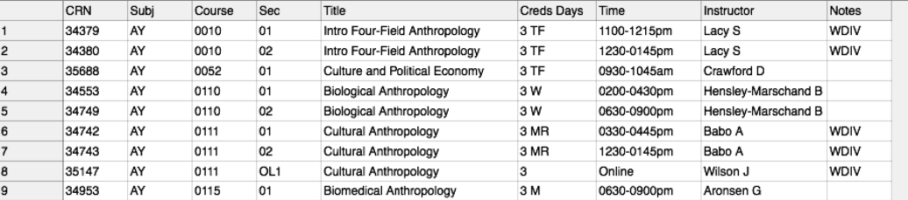
- __The column headers are repeated every so often (e.g., on line 12) and should be skipped.__
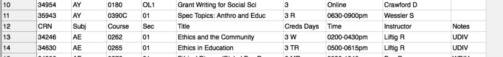
- __On lines 49 and 50 we see that sometimes Tabula misses the break between the `Instructor` and `Notes` columns.__
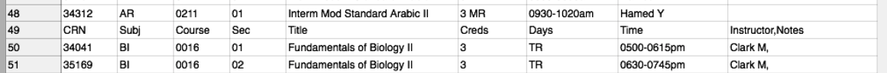
- __On lines 95-98 we see that `Days` and `Time` also collide sometimes.__
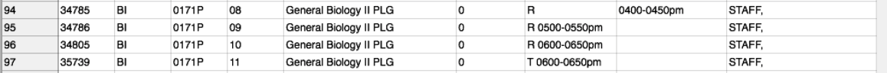
- __On lines 137-143, some classes have extra meeting days and times. The extras are listed on a row by themselves. This is not actually an extraction bug, but rather a quirk of the table design. We'll need to work around it nonetheless.__ 
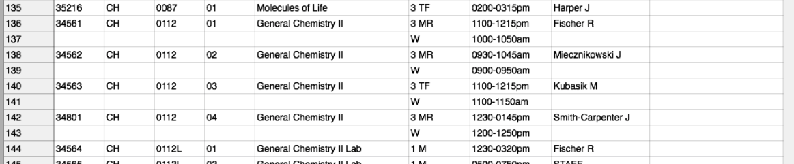

## Cleaning up with Python: A Walkthrough of the Code
__1. The full source code is in the [course_schedules_tabula.py](https://github.com/christopherhuntley/ba505-docs/blob/master/Tutorials/CourseCatalogDemo/course_schedules_tabula.py) module.__  
In this notebook we will study each section, one at a time, to better understand the code. But first, please take a moment to study the file. While some things should be new to you, care has been taken to make it easier to read and follow along on your own:
- Comments are used liberally to explain what each block of code does. 
- Variables and functions are given descriptive names that indicate what they represent or do. 
- White space is used to separate sections from each other. 

Imagine if there were no comments and variables names like x, y, z. Would you still be able to make sense of the code? Even for an experienced coder, reading code like that is hard.   

__2. The file header.__  
The top of the module includes a special comments intended to help us use the code. 

The first two lines are actually for running the file as a `bash` script in MacOS X:
```python
#!/usr/bin/env python3
# -*- coding: utf-8 -*-
```
This tells bash that which python interpretter to use (`python3`) and where to find it (in the `/usr/bin/env folder`). It also says that the rest of the file is uses UTF-8 characters (used by English and similar languages).

The next several lines are a "doc comment" explaining ab bit about the provenance of the code. Sometimes this section may also include a license (e.g., GPL, MIT, BSD, public domain, etc.).  
```python
"""
File: course_schedules_tabula.py

Created on Tue Dec  5 12:57:56 2017

@author: chuntley

A utility for extracting Fairfield U course data from text scraped PDF files using tabula.
Currently works for the Spring 2018 Course Booklet.

"""
```
Doc comments are always triple-quoted and start on the first non # commented line of code. They are used by special software to generate documentation for developers. See an example [here in the Python docs](https://pandas.pydata.org/pandas-docs/stable/generated/pandas.DataFrame.drop.html). (Top-secret pro tip: To see the [actual source code](http://github.com/pandas-dev/pandas/blob/v0.23.4/pandas/core/frame.py#L3576-L3697) for anything in the Python, Numpy, or Pandas docs, just click the "source" link in the upper right-hand corner of the docs page.)   

__3. Imports.__  
To make them easy to find, we always import external modules just after the top comments. 
```python
import re
import csv
import json
```
The modules above happen to be included in the standard library (i.e., vanilla Python). If a module were to come from a third-party library that has to be installed separately, then we would insert a comment with a `pip install` or `conda install` command. 

__4. Constants and Default Values.__
The next section provides a section of configuration data as variables that can be used later in the file. If the data is meant to be static then by convention we would use ALL_CAPS to indicate that it is a constant. If it is meant to be overridable, then we use a standard Python variable.
```python
# A set of tags that appear in the Notes field of a course_spec string
tags = {
  'CLRC':'Creative Life Residential College',
  'CORN':'Cornerstone Course',
  'HYBD':'Hybrid Course',
  'IGRC':'Ignatian Residential College',
  'RCOL':'Residential Colleges',
  'SERO':'Service Learning Option',
  'RNNU':'RN to BSN Students Only',
  'SJRC':'Service for Justice Residential College',
  'SDNU':'Second Degree Nurses Only',
  'UDIV':'U.S. Diversity',
  'SERL':'Service Learning',
  'WDIV':'World Diversity'
}

# A set of regular expressions (regex patterns) to use to extract data fields from a table row
flds = {
    'crn':re.compile('(^[0-9]+)'),
    'catalog_id':re.compile('(^[A-Z]+ [0-9,A-Z]+)'),
    'section':re.compile('(^[0-9,A-Z]+)'),
    'credits':re.compile('(^[0-9])'),
    'timecode':re.compile('(TBA|[Bb]y [Aa]rrangement|[Oo]nline|[MTWRFSU]+ [0-9]{4}-[0-9]{4}[PpAa][Mm])'),
    'tags':re.compile('('+'|'.join(tags.keys())+')'),
    'instructor':re.compile('(.+)'),
    'title':re.compile('(.+)')
}
```
In this case, `tags` and `flds` are designed to be overridden by any code that imports this module by setting `course_schedules_tabula.tags` or `course_schedules_tabula.flds` as needed. 

__5. The `scrape_undergrad_course_booklet()` function.__  
We'll need to skip over the `parse_table_row()` function to the bottom of the file, where we find the primary function of this module:
```python
def scrape_undergrad_course_booklet(filename):
    ''' Parse a course booklet that has been exported as a CSV from Tabula.'''
    with open(filename, newline='') as csvfile:
        linereader = csv.reader(csvfile)
        course_specs =[]
        for row in linereader:
            if not row[0].startswith('CRN'):
                course_spec = parse_table_row(row)
                if 'crn' in course_spec:
                    # add the new course_spec
                    course_specs += [course_spec]
                elif 'timecodes' in course_spec:
                    # merge timecode into last course_spec
                    course_specs[-1]['timecodes'] += course_spec['timecodes']
    return {'course_offerings':course_specs,'tags':tags}
```
The logic is actually pretty straightforward: 
1. Open the file as a CSV file using the standard `csv.reader()` function to break each line into columns.
2. After initializing a `course_specs` accumulator variable (as a blank list), read the CSV file one row at a time.
3. If the row is not a row of column headers then ...
    3a. Use the `parse_table_row()` function (just above it in the file) to create a `course_spec` for the course.
    3b. Handle two possible cases:
        - for normal rows (which have a `crn` key specified), `course_spec` is added to our accumulated list of `course_specs`
        - for extra timecode rows (which don't have a `crn` key but do have a `timecode` key), `course_spec` is merged into the last (previous) `course_spec` on our list. Note that the `'timecodes'` field is a list to allow a course to have more than one timecode. 
4. Return a dictionary with two items. The first item is for the `course_specs` we just created. The other is to provide a list of tags to look for in the notes.     

__6. The `parse_table_row()` Function.__
We'll take this one in slow motion. It's complicated. 

First, why is it above the `scrape_undergrad_course_booklet()` function in the file? Because `parse_table_row()` must exist (i.e., be loaded before) we can use it in `scrape_undergrad_course_booklet()`. Now lets see what it does. 

The top of the function definition specifies the calling signature (function name and parameters) and a doc comment explaining what the function does. Then on the next line it initializes `course_spec`, a dictionary that we will build incrementally as we parse the line into fields (columns), with one dictionary item per column.   
```python
def parse_table_row(row,date_range):
    ''' Parse one row of tabula data; each row is a column-wise list of strings'''
    
    course_spec = {}
```

The next bit of code deals with extra timecodes (Days + Time) that appear on a line by themselves. This is a common design, where easly detected special cases are handled first, with a `return` satement used to 'short-circuit' the function before it tries to handle the normal case. 
```python
    # Deal with extra timecodes on rows by themselves
    if not row[0]:
        unparsed = ' '.join(row)
        # use a regex to extract the timecode
        course_spec['timecodes'] = flds['timecode'].findall(unparsed)

        # return a partial course_spec with just the timecode
        return course_spec
```
The logic is a little tricky but still coherent if you trace it through one line at a time:
- `unparsed = ' '.join(row)` converts the columns back into a line of text with space separators. Huh? Well, if we can't trust the column breaks generated by Tabula then we might as well ignore them.
- `course_spec['timecodes'] = flds['timecode'].findall(unparsed)` uses a [regular expression](https://docs.python.org/2/library/re.html) to extract all timecodes found in the line of text. The specific regular expression is `'(TBA|[Bb]y [Aa]rrangement|[Oo]nline|[MTWRFSU]+ [0-9]{4}-[0-9]{4}[PpAa][Mm])'` as defined in the `flds` variable at the top of the file.   
- `return course_spec` short-circuits function execution, ending the function before the rest can be executed. Note that in this case `course_spec` is a dictionary with a single item: a list of timecodes. 

With the special case handled, the rest of the function deals with the normal case.
```python
    # What follows handles a typical table row exported from tabula

    # Parse out the easier columns that always seem to work in tabula
    course_spec['crn'] = int(row[0])
    course_spec['catalog_id'] = row[1] + ' ' + row[2]
    course_spec['section'] = row[3]
    course_spec['title'] = row[4]

    # Parse out the trickier columns that seem to merge awkwardly in tabula.
    # The logic below applies regular expressions to an unparsed string.
    # For each column:
    #   1. use a regex to extract data from the unparsed string;
    #   2. remove the extracted data from the unparsed string
    unparsed = ' '.join(row[5:]) # create a string of columns

    credits = flds['credits'].findall(unparsed)
    course_spec['credits'] = int(credits[0]) if credits else 0 # number of credits
    unparsed = flds['credits'].sub('',unparsed)

    course_spec['tags'] = flds['tags'].findall(unparsed) # list of tags
    unparsed = flds['tags'].sub('',unparsed)

    course_spec['timecodes']=flds['timecode'].findall(unparsed) # list of timecodes
    unparsed = flds['timecode'].sub('',unparsed)

    course_spec['instructor']=unparsed.strip() # remainder, minus extra whitespace

    return course_spec
```
For columns that never seem to get mangled by Tabula, we can just copy them directly into the dictionary:
```python
# Parse out the easier columns that always seem to work in tabula
    course_spec['crn'] = int(row[0])
    course_spec['catalog_id'] = row[1] + ' ' + row[2]
    course_spec['section'] = row[3]
    course_spec['title'] = row[4]
```
For the other columns we use the same trick as before, using regular expression pattern matches and a bit of validation logic to clean up missing data and bad dates.    

__7. A quick and dirty test.__  
The last line of the module is commented out. It was used to run the code directly (i.e., without a notebook or debugger) from a `bash` command line while it was being written. 
```python
# print(scrape_undergrad_course_booklet('tabula-201801CourseBooklet.csv','01/16-05/01'))
```
__8. Wrapping up: Running the code within a Notebook.__  
Since the code is in a module, we can call it directly within our notebooks. We can even feed it new data (e.g., for this semester) by setting the `filename` and `date_range`. Here is what it generates (which should look familiar to any practiced web developer as JSON) ...

**Code (cell)**
```python
import course_schedules_tabula
course_schedules_tabula.scrape_undergrad_course_booklet('tabula-201801CourseBooklet.csv')['course_offerings'][:200]
```

**Output (in Jupyter)** 

```python
[{'crn': 34379,
  'catalog_id': 'AY 0010',
  'section': '01',
  'title': 'Intro Four-Field Anthropology',
  'credits': 3,
  'tags': ['WDIV'],
  'timecodes': ['TF 1100-1215pm'],
  'instructor': 'Lacy S'},
 {'crn': 34380,
  'catalog_id': 'AY 0010',
  'section': '02',
  'title': 'Intro Four-Field Anthropology',
  'credits': 3,
  'tags': ['WDIV'],
  'timecodes': ['TF 1230-0145pm'],
  'instructor': 'Lacy S'},
 {'crn': 35688,
  'catalog_id': 'AY 0052',
  'section': '01',
  'title': 'Culture and Political Economy',
  'credits': 3,
  'tags': [],
  'timecodes': ['TF 0930-1045am'],
  'instructor': 'Crawford D'},
 {'crn': 34553,
  'catalog_id': 'AY 0110',
  'section': '01',
  'title': 'Biological Anthropology',
  'credits': 3,
  'tags': [],
  'timecodes': ['W 0200-0430pm'],
  'instructor': 'Hensley-Marschand B'},
 {'crn': 34749,
  'catalog_id': 'AY 0110',
  'section': '02',
  'title': 'Biological Anthropology',
  'credits': 3,
  'tags': [],
  'timecodes': ['W 0630-0900pm'],
  'instructor': 'Hensley-Marschand B'},
 {'crn': 34742,
  'catalog_id': 'AY 0111',
  'section': '01',
  'title': 'Cultural Anthropology',
  'credits': 3,
  'tags': ['WDIV'],
  'timecodes': ['MR 0330-0445pm'],
  'instructor': 'Babo A'},
 {'crn': 34743,
  'catalog_id': 'AY 0111',
  'section': '02',
  'title': 'Cultural Anthropology',
  'credits': 3,
  'tags': ['WDIV'],
  'timecodes': ['MR 1230-0145pm'],
  'instructor': 'Babo A'},
 {'crn': 35147,
  'catalog_id': 'AY 0111',
  'section': 'OL1',
  'title': 'Cultural Anthropology',
  'credits': 3,
  'tags': ['WDIV'],
  'timecodes': ['Online'],
  'instructor': 'Wilson J'},
 {'crn': 34953,
  'catalog_id': 'AY 0115',
  'section': '01',
  'title': 'Biomedical Anthropology',
  'credits': 3,
  'tags': [],
  'timecodes': ['M 0630-0900pm'],
  'instructor': 'Aronsen G'},
 {'crn': 34954,
  'catalog_id': 'AY 0180',
  'section': 'OL1',
  'title': 'Grant Writing for Social Sci',
  'credits': 3,
  'tags': [],
  'timecodes': ['Online'],
  'instructor': 'Crawford D'},
 {'crn': 35943,
  'catalog_id': 'AY 0390C',
  'section': '01',
  'title': 'Spec Topics: Anthro and Educ',
  'credits': 3,
  'tags': [],
  'timecodes': ['R 0630-0900pm'],
  'instructor': 'Wessler S'},
 {'crn': 34246,
  'catalog_id': 'AE 0262',
  'section': '01',
  'title': 'Ethics and the Community',
  'credits': 3,
  'tags': ['UDIV'],
  'timecodes': ['W 0200-0430pm'],
  'instructor': 'Liftig R'},
 {'crn': 34630,
  'catalog_id': 'AE 0265',
  'section': '01',
  'title': 'Ethics in Education',
  'credits': 3,
  'tags': ['UDIV'],
  'timecodes': ['TR 0500-0615pm'],
  'instructor': 'Liftig R'},
 {'crn': 34306,
  'catalog_id': 'AE 0276',
  'section': '01',
  'title': 'Ethical Dimens/Global Bus Prac',
  'credits': 3,
  'tags': ['WDIV'],
  'timecodes': ['MR 0930-1045am'],
  'instructor': 'Day R'},
 {'crn': 34247,
  'catalog_id': 'AE 0281',
  'section': '01',
  'title': 'Ethics of Communications',
  'credits': 3,
  'tags': [],
  'timecodes': ['T 0630-0900pm'],
  'instructor': 'Butler B'},
 {'crn': 35934,
  'catalog_id': 'AE 0283',
  'section': '01',
  'title': 'Environmental Justice',
  'credits': 3,
  'tags': [],
  'timecodes': ['M 0630-0900pm'],
  'instructor': 'Newman R'},
 {'crn': 35017,
  'catalog_id': 'AE 0284',
  'section': '01',
  'title': 'Environmental Ethics',
  'credits': 3,
  'tags': [],
  'timecodes': ['TF 1230-0145pm'],
  'instructor': 'Svoboda T'},
 {'crn': 34163,
  'catalog_id': 'AE 0285',
  'section': '01',
  'title': 'Ethics of Health Care',
  'credits': 3,
  'tags': [],
  'timecodes': ['MW 0500-0615pm'],
  'instructor': 'Naser C'},
 {'crn': 35079,
  'catalog_id': 'AE 0285',
  'section': '02',
  'title': 'Ethics of Health Care',
  'credits': 3,
  'tags': [],
  'timecodes': ['T 0500-0730pm'],
  'instructor': 'Newman R'},
 {'crn': 34173,
  'catalog_id': 'AE 0287',
  'section': '01',
  'title': 'Engineering Ethics',
  'credits': 3,
  'tags': [],
  'timecodes': ['MR 0200-0315pm'],
  'instructor': 'Schmidt D'},
 {'crn': 34117,
  'catalog_id': 'AE 0291',
  'section': '01',
  'title': 'Business Ethics',
  'credits': 3,
  'tags': [],
  'timecodes': ['T 0630-0900pm'],
  'instructor': 'Ventrella S'},
 {'crn': 35018,
  'catalog_id': 'AE 0291',
  'section': '02',
  'title': 'Business Ethics',
  'credits': 3,
  'tags': ['IGRC', 'UDIV'],
  'timecodes': ['MR 1100-1215pm'],
  'instructor': 'Lee J'},
 {'crn': 35019,
  'catalog_id': 'AE 0291',
  'section': '03',
  'title': 'Business Ethics',
  'credits': 3,
  'tags': [],
  'timecodes': ['M 0630-0900pm'],
  'instructor': 'Schmidt N'},
 {'crn': 35020,
  'catalog_id': 'AE 0291',
  'section': '04',
  'title': 'Business Ethics',
  'credits': 3,
  'tags': [],
  'timecodes': ['W 0200-0430pm'],
  'instructor': 'Schmidt N'},
 {'crn': 35021,
  'catalog_id': 'AE 0291',
  'section': 'OL1',
  'title': 'Business Ethics',
  'credits': 3,
  'tags': [],
  'timecodes': ['Online'],
  'instructor': 'Sticca-Conrod L'},
 {'crn': 35022,
  'catalog_id': 'AE 0291',
  'section': 'OL2',
  'title': 'Business Ethics',
  'credits': 3,
  'tags': [],
  'timecodes': ['Online'],
  'instructor': 'Sticca-Conrod L'},
 {'crn': 35384,
  'catalog_id': 'AE 0291',
  'section': 'OL3',
  'title': 'Business Ethics',
  'credits': 3,
  'tags': [],
  'timecodes': ['Online'],
  'instructor': 'Yoder J'},
 {'crn': 34123,
  'catalog_id': 'AE 0391',
  'section': '01',
  'title': 'Sem Bus Law,Regulation &Ethics',
  'credits': 3,
  'tags': [],
  'timecodes': ['M 0630-0900pm'],
  'instructor': 'Schmidt D'},
 {'crn': 34178,
  'catalog_id': 'AH 0010',
  'section': '01',
  'title': 'Origins & Transform Westrn Art',
  'credits': 3,
  'tags': [],
  'timecodes': ['TF 0930-1045am'],
  'instructor': 'Paqua M'},
 {'crn': 35692,
  'catalog_id': 'AH 0010',
  'section': '02',
  'title': 'Origins & Transform Westrn Art',
  'credits': 3,
  'tags': [],
  'timecodes': ['TF 1100-1215pm'],
  'instructor': 'Schwab K'},
 {'crn': 35693,
  'catalog_id': 'AH 0010',
  'section': '03',
  'title': 'Origins & Transform Westrn Art',
  'credits': 3,
  'tags': [],
  'timecodes': ['TF 0200-0315pm'],
  'instructor': 'Schwab K'},
 {'crn': 34074,
  'catalog_id': 'AH 0011',
  'section': '01',
  'title': 'Visual Culture Since 1400',
  'credits': 3,
  'tags': ['CLRC', 'SJRC'],
  'timecodes': ['TF 1100-1215pm'],
  'instructor': 'Rose M'},
 {'crn': 34075,
  'catalog_id': 'AH 0011',
  'section': '02',
  'title': 'Visual Culture Since 1400',
  'credits': 3,
  'tags': [],
  'timecodes': ['MR 0930-1045am'],
  'instructor': 'Eliasoph P'},
 {'crn': 34076,
  'catalog_id': 'AH 0011',
  'section': '03',
  'title': 'Visual Culture Since 1400',
  'credits': 3,
  'tags': [],
  'timecodes': ['MR 1100-1215pm'],
  'instructor': 'Eliasoph P'},
 {'crn': 34294,
  'catalog_id': 'AH 0011',
  'section': '04',
  'title': 'Visual Culture Since 1400',
  'credits': 3,
  'tags': [],
  'timecodes': ['M 0630-0900pm'],
  'instructor': 'Eliasoph P'},
 {'crn': 35694,
  'catalog_id': 'AH 0102',
  'section': '01',
  'title': 'Art of East Asia',
  'credits': 3,
  'tags': ['WDIV'],
  'timecodes': ['TF 1230-0145pm'],
  'instructor': 'Covaci I'},
 {'crn': 35695,
  'catalog_id': 'AH 0111',
  'section': '01',
  'title': 'Greek Art and Archaeology',
  'credits': 3,
  'tags': [],
  'timecodes': ['MR 0930-1045am'],
  'instructor': 'Schwab K'},
 {'crn': 35696,
  'catalog_id': 'AH 0131',
  'section': '01',
  'title': 'HighRenaissnce&Mannerism/Italy',
  'credits': 3,
  'tags': ['IGRC'],
  'timecodes': ['M 0500-0730pm'],
  'instructor': 'DiMarzo M'},
 {'crn': 35697,
  'catalog_id': 'AH 0165',
  'section': '01',
  'title': 'African-American Art',
  'credits': 3,
  'tags': ['UDIV'],
  'timecodes': ['TR 0800-0915pm'],
  'instructor': 'STAFF'},
 {'crn': 34171,
  'catalog_id': 'AH 0330',
  'section': '01',
  'title': 'Senior Capstone Seminar',
  'credits': 3,
  'tags': [],
  'timecodes': ['W 1100-0130pm'],
  'instructor': 'Eliasoph P'},
 {'crn': 35100,
  'catalog_id': 'AH 0330A',
  'section': '01',
  'title': 'Senior Capstone Seminar',
  'credits': 3,
  'tags': [],
  'timecodes': ['W 1100-0130pm'],
  'instructor': 'Eliasoph P'},
 {'crn': 35347,
  'catalog_id': 'AN 0310',
  'section': '01',
  'title': 'Asian Studies Seminar',
  'credits': 3,
  'tags': [],
  'timecodes': ['By Arrangement'],
  'instructor': 'Li D'},
 {'crn': 34257,
  'catalog_id': 'AR 0111',
  'section': '01',
  'title': 'Elem Modern Standard Arabic II',
  'credits': 3,
  'tags': [],
  'timecodes': ['MWR 0800-0850am'],
  'instructor': 'Hamed Y'},
 {'crn': 34312,
  'catalog_id': 'AR 0211',
  'section': '01',
  'title': 'Interm Mod Standard Arabic II',
  'credits': 3,
  'tags': [],
  'timecodes': ['MR 0930-1020am'],
  'instructor': 'Hamed Y'},
 {'crn': 34041,
  'catalog_id': 'BI 0016',
  'section': '01',
  'title': 'Fundamentals of Biology II',
  'credits': 3,
  'tags': [],
  'timecodes': ['TR 0500-0615pm'],
  'instructor': 'Clark M'},
 {'crn': 35169,
  'catalog_id': 'BI 0016',
  'section': '02',
  'title': 'Fundamentals of Biology II',
  'credits': 3,
  'tags': [],
  'timecodes': ['TR 0630-0745pm'],
  'instructor': 'Clark M'},
 {'crn': 34221,
  'catalog_id': 'BI 0018',
  'section': '01',
  'title': 'Human Biology: Form & Function',
  'credits': 3,
  'tags': [],
  'timecodes': ['MR 0200-0315pm'],
  'instructor': 'Dutta I'},
 {'crn': 34631,
  'catalog_id': 'BI 0018',
  'section': '02',
  'title': 'Human Biology: Form & Function',
  'credits': 3,
  'tags': [],
  'timecodes': ['MR 0330-0445pm'],
  'instructor': 'Dutta I'},
 {'crn': 35170,
  'catalog_id': 'BI 0018',
  'section': '03',
  'title': 'Human Biology: Form & Function',
  'credits': 3,
  'tags': [],
  'timecodes': ['MR 0200-0315pm'],
  'instructor': 'Zavras E'},
 {'crn': 35734,
  'catalog_id': 'BI 0071',
  'section': 'OL1',
  'title': 'Identity and the Human Genome',
  'credits': 3,
  'tags': [],
  'timecodes': ['Online'],
  'instructor': 'Rodriguez C'},
 {'crn': 34350,
  'catalog_id': 'BI 0074',
  'section': '01',
  'title': 'Biology of Food',
  'credits': 3,
  'tags': [],
  'timecodes': ['TF 1100-1215pm'],
  'instructor': 'Osier T'},
 {'crn': 34787,
  'catalog_id': 'BI 0078',
  'section': '01',
  'title': 'Introduction to Marine Science',
  'credits': 3,
  'tags': [],
  'timecodes': ['TR 0500-0615pm'],
  'instructor': 'Ortman B'},
 {'crn': 34788,
  'catalog_id': 'BI 0078',
  'section': '02',
  'title': 'Introduction to Marine Science',
  'credits': 3,
  'tags': [],
  'timecodes': ['TR 0630-0745pm'],
  'instructor': 'Ortman B'},
 {'crn': 34042,
  'catalog_id': 'BI 0108',
  'section': '01',
  'title': 'Human Anatomy & Physiology II',
  'credits': 4,
  'tags': [],
  'timecodes': ['MR 1100-1215pm'],
  'instructor': 'Earls C'},
 {'crn': 34557,
  'catalog_id': 'BI 0108',
  'section': '02',
  'title': 'Human Anatomy & Physiology II',
  'credits': 4,
  'tags': [],
  'timecodes': ['MR 1230-0145pm'],
  'instructor': 'DeCristofaro A'},
 {'crn': 34352,
  'catalog_id': 'BI 0108L',
  'section': '01',
  'title': 'Human Anatomy & Physiology Lab',
  'credits': 0,
  'tags': [],
  'timecodes': ['M 0100-0350pm'],
  'instructor': 'Earls C'},
 {'crn': 34353,
  'catalog_id': 'BI 0108L',
  'section': '02',
  'title': 'Human Anatomy & Physiology Lab',
  'credits': 0,
  'tags': [],
  'timecodes': ['T 0900-1150am'],
  'instructor': 'Sauer D'},
 {'crn': 34354,
  'catalog_id': 'BI 0108L',
  'section': '03',
  'title': 'Human Anatomy & Physiology Lab',
  'credits': 0,
  'tags': [],
  'timecodes': ['W 0830-1120am'],
  'instructor': 'DeCristofaro A'},
 {'crn': 34355,
  'catalog_id': 'BI 0108L',
  'section': '04',
  'title': 'Human Anatomy & Physiology Lab',
  'credits': 0,
  'tags': [],
  'timecodes': ['W 1230-0320pm'],
  'instructor': 'DeCristofaro A'},
 {'crn': 34356,
  'catalog_id': 'BI 0108L',
  'section': '05',
  'title': 'Human Anatomy & Physiology Lab',
  'credits': 0,
  'tags': [],
  'timecodes': ['W 0530-0820pm'],
  'instructor': 'Karpinski J'},
 {'crn': 34558,
  'catalog_id': 'BI 0108L',
  'section': '06',
  'title': 'Human Anatomy & Physiology Lab',
  'credits': 0,
  'tags': [],
  'timecodes': ['R 0100-0350pm'],
  'instructor': 'Earls C'},
 {'crn': 34789,
  'catalog_id': 'BI 0108L',
  'section': '07',
  'title': 'Human Anatomy & Physiology Lab',
  'credits': 0,
  'tags': [],
  'timecodes': ['F 1000-1250pm'],
  'instructor': 'Earls C'},
 {'crn': 35171,
  'catalog_id': 'BI 0108L',
  'section': '08',
  'title': 'Human Anatomy & Physiology Lab',
  'credits': 0,
  'tags': [],
  'timecodes': ['M 0900-1150am'],
  'instructor': 'DeCristofaro A'},
 {'crn': 35172,
  'catalog_id': 'BI 0108L',
  'section': '09',
  'title': 'Human Anatomy & Physiology Lab',
  'credits': 0,
  'tags': [],
  'timecodes': ['R 0900-1150am'],
  'instructor': 'Sauer D'},
 {'crn': 35735,
  'catalog_id': 'BI 0108L',
  'section': '10',
  'title': 'Human Anatomy & Physiology Lab',
  'credits': 0,
  'tags': [],
  'timecodes': ['M 0530-0820pm'],
  'instructor': 'Date S'},
 {'crn': 34141,
  'catalog_id': 'BI 0151',
  'section': '01',
  'title': 'Elements of Microbiology',
  'credits': 4,
  'tags': [],
  'timecodes': ['MR 1230-0145pm'],
  'instructor': 'Rodriguez C'},
 {'crn': 35736,
  'catalog_id': 'BI 0151',
  'section': '02',
  'title': 'Elements of Microbiology',
  'credits': 4,
  'tags': [],
  'timecodes': ['TF 1230-0145pm'],
  'instructor': 'Rodriguez C'},
 {'crn': 34357,
  'catalog_id': 'BI 0151L',
  'section': '01',
  'title': 'Elements of Microbiology Lab',
  'credits': 0,
  'tags': [],
  'timecodes': ['M 0200-0450pm'],
  'instructor': 'STAFF'},
 {'crn': 34358,
  'catalog_id': 'BI 0151L',
  'section': '02',
  'title': 'Elements of Microbiology Lab',
  'credits': 0,
  'tags': [],
  'timecodes': ['T 0930-1220pm'],
  'instructor': 'John L'},
 {'crn': 34771,
  'catalog_id': 'BI 0151L',
  'section': '03',
  'title': 'Elements of Microbiology Lab',
  'credits': 0,
  'tags': [],
  'timecodes': ['T 0200-0450pm'],
  'instructor': 'John L'},
 {'crn': 35173,
  'catalog_id': 'BI 0151L',
  'section': '04',
  'title': 'Elements of Microbiology Lab',
  'credits': 0,
  'tags': [],
  'timecodes': ['W 0200-0450pm'],
  'instructor': 'STAFF'},
 {'crn': 35737,
  'catalog_id': 'BI 0151L',
  'section': '05',
  'title': 'Elements of Microbiology Lab',
  'credits': 0,
  'tags': [],
  'timecodes': ['R 0200-0450pm'],
  'instructor': 'Rodriguez C'},
 {'crn': 34142,
  'catalog_id': 'BI 0171',
  'section': '01',
  'title': 'General Biology II',
  'credits': 4,
  'tags': [],
  'timecodes': ['TF 0930-1045am'],
  'instructor': 'Andersen C'},
 {'crn': 34359,
  'catalog_id': 'BI 0171',
  'section': '02',
  'title': 'General Biology II',
  'credits': 4,
  'tags': [],
  'timecodes': ['TF 1230-0145pm'],
  'instructor': 'Andersen C'},
 {'crn': 34360,
  'catalog_id': 'BI 0171L',
  'section': '01',
  'title': 'General Biology II Lab',
  'credits': 0,
  'tags': [],
  'timecodes': ['M 0200-0450pm'],
  'instructor': 'Braun P'},
 {'crn': 34361,
  'catalog_id': 'BI 0171L',
  'section': '02',
  'title': 'General Biology II Lab',
  'credits': 0,
  'tags': [],
  'timecodes': ['M 0200-0450pm'],
  'instructor': 'Biardi L'},
 {'crn': 34362,
  'catalog_id': 'BI 0171L',
  'section': '03',
  'title': 'General Biology II Lab',
  'credits': 0,
  'tags': [],
  'timecodes': ['T 0200-0450pm'],
  'instructor': 'Brousseau D'},
 {'crn': 34363,
  'catalog_id': 'BI 0171L',
  'section': '04',
  'title': 'General Biology II Lab',
  'credits': 0,
  'tags': [],
  'timecodes': ['T 0200-0450pm'],
  'instructor': 'Karpinski J'},
 {'crn': 34364,
  'catalog_id': 'BI 0171L',
  'section': '05',
  'title': 'General Biology II Lab',
  'credits': 0,
  'tags': [],
  'timecodes': ['W 0530-0820pm'],
  'instructor': 'Biardi L'},
 {'crn': 35174,
  'catalog_id': 'BI 0171L',
  'section': '06',
  'title': 'General Biology II Lab',
  'credits': 0,
  'tags': [],
  'timecodes': ['R 0200-0450pm'],
  'instructor': 'Braun P'},
 {'crn': 35738,
  'catalog_id': 'BI 0171L',
  'section': '07',
  'title': 'General Biology II Lab',
  'credits': 0,
  'tags': [],
  'timecodes': ['R 0200-0450pm'],
  'instructor': 'STAFF'},
 {'crn': 34777,
  'catalog_id': 'BI 0171P',
  'section': '01',
  'title': 'General Biology II PLG',
  'credits': 0,
  'tags': [],
  'timecodes': ['T 0300-0350pm'],
  'instructor': 'STAFF'},
 {'crn': 34779,
  'catalog_id': 'BI 0171P',
  'section': '02',
  'title': 'General Biology II PLG',
  'credits': 0,
  'tags': [],
  'timecodes': ['T 0400-0450pm'],
  'instructor': 'STAFF'},
 {'crn': 34780,
  'catalog_id': 'BI 0171P',
  'section': '03',
  'title': 'General Biology II PLG',
  'credits': 0,
  'tags': [],
  'timecodes': ['T 0500-0550pm'],
  'instructor': 'STAFF'},
 {'crn': 34781,
  'catalog_id': 'BI 0171P',
  'section': '04',
  'title': 'General Biology II PLG',
  'credits': 0,
  'tags': [],
  'timecodes': ['W 0300-0350pm'],
  'instructor': 'STAFF'},
 {'crn': 34782,
  'catalog_id': 'BI 0171P',
  'section': '05',
  'title': 'General Biology II PLG',
  'credits': 0,
  'tags': [],
  'timecodes': ['W 0400-0450pm'],
  'instructor': 'STAFF'},
 {'crn': 34783,
  'catalog_id': 'BI 0171P',
  'section': '06',
  'title': 'General Biology II PLG',
  'credits': 0,
  'tags': [],
  'timecodes': ['W 0500-0550pm'],
  'instructor': 'STAFF'},
 {'crn': 34784,
  'catalog_id': 'BI 0171P',
  'section': '07',
  'title': 'General Biology II PLG',
  'credits': 0,
  'tags': [],
  'timecodes': ['R 0300-0350pm'],
  'instructor': 'STAFF'},
 {'crn': 34785,
  'catalog_id': 'BI 0171P',
  'section': '08',
  'title': 'General Biology II PLG',
  'credits': 0,
  'tags': [],
  'timecodes': ['R 0400-0450pm'],
  'instructor': 'STAFF'},
 {'crn': 34786,
  'catalog_id': 'BI 0171P',
  'section': '09',
  'title': 'General Biology II PLG',
  'credits': 0,
  'tags': [],
  'timecodes': ['R 0500-0550pm'],
  'instructor': 'STAFF'},
 {'crn': 34805,
  'catalog_id': 'BI 0171P',
  'section': '10',
  'title': 'General Biology II PLG',
  'credits': 0,
  'tags': [],
  'timecodes': ['R 0600-0650pm'],
  'instructor': 'STAFF'},
 {'crn': 35739,
  'catalog_id': 'BI 0171P',
  'section': '11',
  'title': 'General Biology II PLG',
  'credits': 0,
  'tags': [],
  'timecodes': ['T 0600-0650pm'],
  'instructor': 'STAFF'},
 {'crn': 35740,
  'catalog_id': 'BI 0171P',
  'section': '12',
  'title': 'General Biology II PLG',
  'credits': 0,
  'tags': [],
  'timecodes': ['W 0600-0650pm'],
  'instructor': 'STAFF'},
 {'crn': 35087,
  'catalog_id': 'BI 0201',
  'section': '01',
  'title': 'Biology Teaching Practicum',
  'credits': 1,
  'tags': [],
  'timecodes': ['By Arrangement'],
  'instructor': 'Gerry S'},
 {'crn': 35088,
  'catalog_id': 'BI 0202',
  'section': '01',
  'title': 'Biology Teaching Practicum',
  'credits': 1,
  'tags': [],
  'timecodes': ['By Arrangement'],
  'instructor': 'Gerry S'},
 {'crn': 35175,
  'catalog_id': 'BI 0203',
  'section': '01',
  'title': 'Biology Teaching Practicum',
  'credits': 1,
  'tags': [],
  'timecodes': ['By Arrangement'],
  'instructor': 'Gerry S'},
 {'crn': 35176,
  'catalog_id': 'BI 0204',
  'section': '01',
  'title': 'Biology Teaching Practicum',
  'credits': 1,
  'tags': [],
  'timecodes': ['By Arrangement'],
  'instructor': 'Gerry S'},
 {'crn': 35741,
  'catalog_id': 'BI 0205',
  'section': '01',
  'title': 'Biology Teaching Practicum',
  'credits': 1,
  'tags': [],
  'timecodes': ['By Arrangement'],
  'instructor': 'Gerry S'},
 {'crn': 34310,
  'catalog_id': 'BI 0261',
  'section': '01',
  'title': 'Genetics',
  'credits': 4,
  'tags': [],
  'timecodes': ['TF 0930-1045am'],
  'instructor': 'Church G'},
 {'crn': 34365,
  'catalog_id': 'BI 0261L',
  'section': '01',
  'title': 'Genetics Lab',
  'credits': 0,
  'tags': [],
  'timecodes': ['T 0200-0450pm'],
  'instructor': 'Church G'},
 {'crn': 34366,
  'catalog_id': 'BI 0261L',
  'section': '02',
  'title': 'Genetics Lab',
  'credits': 0,
  'tags': [],
  'timecodes': ['W 0200-0450pm'],
  'instructor': 'Fernandez A'},
 {'crn': 35742,
  'catalog_id': 'BI 0262',
  'section': '01',
  'title': 'Human Physiology',
  'credits': 4,
  'tags': [],
  'timecodes': ['MR 0930-1045am'],
  'instructor': 'Moran C'},
 {'crn': 35743,
  'catalog_id': 'BI 0262L',
  'section': '01',
  'title': 'Human Physiology Lab',
  'credits': 0,
  'tags': [],
  'timecodes': ['T 0200-0450pm'],
  'instructor': 'Gerry S'},
 {'crn': 35113,
  'catalog_id': 'BI 0296',
  'section': '01',
  'title': 'Special Topics in Biology',
  'credits': 3,
  'tags': [],
  'timecodes': ['By Arrangement'],
  'instructor': 'Phelan S'},
 {'crn': 35744,
  'catalog_id': 'BI 0319',
  'section': '01',
  'title': 'Zoology Field Experience',
  'credits': 3,
  'tags': ['SERL'],
  'timecodes': ['W 1100-0130pm'],
  'instructor': 'Byun S'},
 {'crn': 35745,
  'catalog_id': 'BI 0319L',
  'section': '01',
  'title': 'Zoology Field Experience Lab',
  'credits': 3,
  'tags': ['SERL'],
  'timecodes': ['W 1100-0130pm'],
  'instructor': 'Byun S'},
 {'crn': 34297,
  'catalog_id': 'BI 0324',
  'section': '01',
  'title': 'Biochemistry I',
  'credits': 3,
  'tags': [],
  'timecodes': ['MR 0930-1045am'],
  'instructor': 'Smith-Carpenter J'},
 {'crn': 34367,
  'catalog_id': 'BI 0324L',
  'section': '01',
  'title': 'Biochemistry Lab',
  'credits': 1,
  'tags': [],
  'timecodes': ['W 0200-0450pm'],
  'instructor': 'Smith-Carpenter J'},
 {'crn': 35179,
  'catalog_id': 'BI 0327',
  'section': '01',
  'title': 'Cell Biology',
  'credits': 4,
  'tags': [],
  'timecodes': ['TF 1100-1215pm'],
  'instructor': 'Phelan S'},
 {'crn': 35182,
  'catalog_id': 'BI 0327L',
  'section': '01',
  'title': 'Cell Biology Lab',
  'credits': 0,
  'tags': [],
  'timecodes': ['T 0200-0450pm'],
  'instructor': 'Phelan S'},
 {'crn': 35746,
  'catalog_id': 'BI 0330',
  'section': '01',
  'title': 'Nutrient Metabolism',
  'credits': 3,
  'tags': [],
  'timecodes': ['MR 1100-1215pm'],
  'instructor': 'Andersen C'},
 {'crn': 35747,
  'catalog_id': 'BI 0342',
  'section': '01',
  'title': 'Developmental Biology',
  'credits': 4,
  'tags': [],
  'timecodes': ['TF 0930-1045am'],
  'instructor': 'Fernandez A'},
 {'crn': 35748,
  'catalog_id': 'BI 0342L',
  'section': '01',
  'title': 'Developmental Biology Lab',
  'credits': 0,
  'tags': [],
  'timecodes': ['T 0200-0450pm'],
  'instructor': 'Fernandez A'},
 {'crn': 35749,
  'catalog_id': 'BI 0357',
  'section': '01',
  'title': 'General Virology',
  'credits': 3,
  'tags': [],
  'timecodes': ['MR 1230-0145pm'],
  'instructor': 'Braun P'},
 {'crn': 35750,
  'catalog_id': 'BI 0364',
  'section': '01',
  'title': 'Freshwater Ecology',
  'credits': 4,
  'tags': [],
  'timecodes': ['MR 1100-1215pm'],
  'instructor': 'Klug J'},
 {'crn': 35751,
  'catalog_id': 'BI 0364L',
  'section': '01',
  'title': 'Freshwater Ecology Lab',
  'credits': 0,
  'tags': [],
  'timecodes': ['R 0200-0450pm'],
  'instructor': 'Klug J'},
 {'crn': 35112,
  'catalog_id': 'BI 0398',
  'section': '01',
  'title': 'Internship',
  'credits': 3,
  'tags': [],
  'timecodes': ['By Arrangement'],
  'instructor': 'Gerry S'},
 {'crn': 35188,
  'catalog_id': 'BI 0399F',
  'section': '01',
  'title': 'Capstone: Coral Reef Ecology',
  'credits': 3,
  'tags': [],
  'timecodes': ['W 0200-0430pm'],
  'instructor': 'Brousseau D'},
 {'crn': 35754,
  'catalog_id': 'BI 0399K',
  'section': '01',
  'title': 'Capstone Seminar: Ichthyology',
  'credits': 3,
  'tags': [],
  'timecodes': ['MR 0930-1045am'],
  'instructor': 'Gerry S'},
 {'crn': 35095,
  'catalog_id': 'CH 0033',
  'section': '01',
  'title': 'Chemistry of Nutrition',
  'credits': 3,
  'tags': [],
  'timecodes': ['TF 0330-0445pm'],
  'instructor': 'Harper J'},
 {'crn': 34127,
  'catalog_id': 'CH 0084',
  'section': '01',
  'title': 'Gen Chem for Health Sciences',
  'credits': 3,
  'tags': [],
  'timecodes': ['TF 0930-1045am'],
  'instructor': 'Reilly-Wiedow E'},
 {'crn': 35760,
  'catalog_id': 'CH 0084',
  'section': '02',
  'title': 'Gen Chem for Health Sciences',
  'credits': 3,
  'tags': [],
  'timecodes': ['TF 0200-0315pm'],
  'instructor': 'Reilly-Wiedow E'},
 {'crn': 34368,
  'catalog_id': 'CH 0084L',
  'section': '01',
  'title': 'Gen Chem for Health Sci Lab',
  'credits': 1,
  'tags': [],
  'timecodes': ['M 0900-1150am'],
  'instructor': "O'Connell E"},
 {'crn': 34369,
  'catalog_id': 'CH 0084L',
  'section': '02',
  'title': 'Gen Chem for Health Sci Lab',
  'credits': 1,
  'tags': [],
  'timecodes': ['T 0900-1150am'],
  'instructor': 'Wolanin D'},
 {'crn': 34633,
  'catalog_id': 'CH 0084L',
  'section': '03',
  'title': 'Gen Chem for Health Sci Lab',
  'credits': 1,
  'tags': [],
  'timecodes': ['W 0900-1150am'],
  'instructor': 'Reilly-Wiedow E'},
 {'crn': 34729,
  'catalog_id': 'CH 0084L',
  'section': '04',
  'title': 'Gen Chem for Health Sci Lab',
  'credits': 1,
  'tags': [],
  'timecodes': ['R 0900-1150am'],
  'instructor': "O'Connell E"},
 {'crn': 35215,
  'catalog_id': 'CH 0084L',
  'section': '05',
  'title': 'Gen Chem for Health Sci Lab',
  'credits': 1,
  'tags': [],
  'timecodes': ['R 0100-0350pm'],
  'instructor': 'Reilly-Wiedow E'},
 {'crn': 34319,
  'catalog_id': 'CH 0086',
  'section': '01',
  'title': 'Chemistry and Art',
  'credits': 3,
  'tags': [],
  'timecodes': ['TR 0500-0615pm'],
  'instructor': 'Sobczynski D'},
 {'crn': 35216,
  'catalog_id': 'CH 0087',
  'section': '01',
  'title': 'Molecules of Life',
  'credits': 3,
  'tags': [],
  'timecodes': ['TF 0200-0315pm'],
  'instructor': 'Harper J'},
 {'crn': 34561,
  'catalog_id': 'CH 0112',
  'section': '01',
  'title': 'General Chemistry II',
  'credits': 3,
  'tags': [],
  'timecodes': ['MR 1100-1215pm', 'W 1000-1050am'],
  'instructor': 'Fischer R'},
 {'crn': 34562,
  'catalog_id': 'CH 0112',
  'section': '02',
  'title': 'General Chemistry II',
  'credits': 3,
  'tags': [],
  'timecodes': ['MR 0930-1045am', 'W 0900-0950am'],
  'instructor': 'Miecznikowski J'},
 {'crn': 34563,
  'catalog_id': 'CH 0112',
  'section': '03',
  'title': 'General Chemistry II',
  'credits': 3,
  'tags': [],
  'timecodes': ['TF 1100-1215pm', 'W 1100-1150am'],
  'instructor': 'Kubasik M'},
 {'crn': 34801,
  'catalog_id': 'CH 0112',
  'section': '04',
  'title': 'General Chemistry II',
  'credits': 3,
  'tags': [],
  'timecodes': ['MR 1230-0145pm', 'W 1200-1250pm'],
  'instructor': 'Smith-Carpenter J'},
 {'crn': 34564,
  'catalog_id': 'CH 0112L',
  'section': '01',
  'title': 'General Chemistry II Lab',
  'credits': 1,
  'tags': [],
  'timecodes': ['M 1230-0320pm'],
  'instructor': 'Fischer R'},
 {'crn': 34565,
  'catalog_id': 'CH 0112L',
  'section': '02',
  'title': 'General Chemistry II Lab',
  'credits': 1,
  'tags': [],
  'timecodes': ['M 0500-0750pm'],
  'instructor': 'STAFF'},
 {'crn': 34566,
  'catalog_id': 'CH 0112L',
  'section': '03',
  'title': 'General Chemistry II Lab',
  'credits': 1,
  'tags': [],
  'timecodes': ['T 1230-0320pm'],
  'instructor': 'STAFF'},
 {'crn': 34567,
  'catalog_id': 'CH 0112L',
  'section': '04',
  'title': 'General Chemistry II Lab',
  'credits': 1,
  'tags': [],
  'timecodes': ['T 0500-0750pm'],
  'instructor': 'Fischer S'},
 {'crn': 34568,
  'catalog_id': 'CH 0112L',
  'section': '05',
  'title': 'General Chemistry II Lab',
  'credits': 1,
  'tags': [],
  'timecodes': ['W 0100-0350pm'],
  'instructor': 'Miecznikowski J'},
 {'crn': 34962,
  'catalog_id': 'CH 0112L',
  'section': '06',
  'title': 'General Chemistry II Lab',
  'credits': 1,
  'tags': [],
  'timecodes': ['W 0500-0750pm'],
  'instructor': 'Fischer S'},
 {'crn': 35217,
  'catalog_id': 'CH 0112L',
  'section': '07',
  'title': 'General Chemistry II Lab',
  'credits': 1,
  'tags': [],
  'timecodes': ['R 1230-0320pm'],
  'instructor': 'STAFF'},
 {'crn': 35761,
  'catalog_id': 'CH 0112L',
  'section': '08',
  'title': 'General Chemistry II Lab',
  'credits': 1,
  'tags': [],
  'timecodes': ['F 1230-0320pm'],
  'instructor': 'Chintapalli S'},
 {'crn': 35762,
  'catalog_id': 'CH 0112L',
  'section': '09',
  'title': 'General Chemistry II Lab',
  'credits': 1,
  'tags': [],
  'timecodes': ['R 0500-0750pm'],
  'instructor': 'STAFF'},
 {'crn': 34046,
  'catalog_id': 'CH 0212',
  'section': '01',
  'title': 'Organic Chemistry II',
  'credits': 3,
  'tags': [],
  'timecodes': ['MR 0800-0915am', 'W 0800-0850am'],
  'instructor': 'Steffen L'},
 {'crn': 34047,
  'catalog_id': 'CH 0212',
  'section': '02',
  'title': 'Organic Chemistry II',
  'credits': 3,
  'tags': [],
  'timecodes': ['TF 0930-1045am', 'W 0900-0950am'],
  'instructor': "O'Connell E"},
 {'crn': 35218,
  'catalog_id': 'CH 0212',
  'section': '03',
  'title': 'Organic Chemistry II',
  'credits': 3,
  'tags': ['RCOL'],
  'timecodes': ['MR 0930-1045am', 'W 0900-0950am'],
  'instructor': 'Van Dyke A'},
 {'crn': 34370,
  'catalog_id': 'CH 0212L',
  'section': '01',
  'title': 'Organic Chemistry II Lab',
  'credits': 1,
  'tags': [],
  'timecodes': ['M 0100-0450pm'],
  'instructor': 'Van Dyke A'},
 {'crn': 34371,
  'catalog_id': 'CH 0212L',
  'section': '02',
  'title': 'Organic Chemistry II Lab',
  'credits': 1,
  'tags': [],
  'timecodes': ['M 0500-0850pm'],
  'instructor': 'Van Dyke A'},
 {'crn': 34372,
  'catalog_id': 'CH 0212L',
  'section': '03',
  'title': 'Organic Chemistry II Lab',
  'credits': 1,
  'tags': [],
  'timecodes': ['T 1230-0430pm'],
  'instructor': 'Schirmann P'},
 {'crn': 34373,
  'catalog_id': 'CH 0212L',
  'section': '04',
  'title': 'Organic Chemistry II Lab',
  'credits': 1,
  'tags': [],
  'timecodes': ['W 0100-0450pm'],
  'instructor': 'Steffen L'},
 {'crn': 35219,
  'catalog_id': 'CH 0212L',
  'section': '05',
  'title': 'Organic Chemistry II Lab',
  'credits': 1,
  'tags': [],
  'timecodes': ['R 0500-0850pm'],
  'instructor': 'Schirmann P'},
 {'crn': 34048,
  'catalog_id': 'CH 0222',
  'section': '01',
  'title': 'Chemical Analysis',
  'credits': 3,
  'tags': [],
  'timecodes': ['MR 1100-1215pm'],
  'instructor': 'Harper-Leatherman A'},
 {'crn': 34632,
  'catalog_id': 'CH 0222L',
  'section': '01',
  'title': 'Chemical Analysis Lab',
  'credits': 1,
  'tags': [],
  'timecodes': ['W 0100-0450pm'],
  'instructor': 'Harper-Leatherman A'},
 {'crn': 35964,
  'catalog_id': 'CH 0222L',
  'section': '02',
  'title': 'Chemical Analysis Lab',
  'credits': 1,
  'tags': [],
  'timecodes': ['T 1230-0420pm'],
  'instructor': 'Harper-Leatherman A'},
 {'crn': 34251,
  'catalog_id': 'CH 0262',
  'section': '01',
  'title': 'Physical Chemistry II',
  'credits': 3,
  'tags': [],
  'timecodes': ['TWF 1100-1150am'],
  'instructor': 'Weddle G'},
 {'crn': 34374,
  'catalog_id': 'CH 0262L',
  'section': '01',
  'title': 'Physical Chemistry II Lab',
  'credits': 1,
  'tags': [],
  'timecodes': ['T 1230-0330pm'],
  'instructor': 'Weddle G'},
 {'crn': 34222,
  'catalog_id': 'CH 0324',
  'section': '01',
  'title': 'Biochemistry I',
  'credits': 3,
  'tags': [],
  'timecodes': ['MR 0930-1045am'],
  'instructor': 'Smith-Carpenter J'},
 {'crn': 34375,
  'catalog_id': 'CH 0324L',
  'section': '01',
  'title': 'Biochemistry Lab',
  'credits': 1,
  'tags': [],
  'timecodes': ['W 0200-0450pm'],
  'instructor': 'Smith-Carpenter J'},
 {'crn': 34963,
  'catalog_id': 'CH 0326L',
  'section': '01',
  'title': 'Instrum-Analy Chemical Lab',
  'credits': 3,
  'tags': [],
  'timecodes': ['MR 0200-0450pm'],
  'instructor': 'Kubasik M'},
 {'crn': 34258,
  'catalog_id': 'CI 0111',
  'section': '01',
  'title': 'Elementary Chinese II',
  'credits': 3,
  'tags': [],
  'timecodes': ['MWR 0200-0250pm'],
  'instructor': 'Xiao J'},
 {'crn': 34259,
  'catalog_id': 'CI 0211',
  'section': '01',
  'title': 'Intermediate Chinese II',
  'credits': 3,
  'tags': [],
  'timecodes': ['MR 1230-0120pm', 'W 1200-1250pm'],
  'instructor': 'Xiao J'},
 {'crn': 35764,
  'catalog_id': 'CI 0221',
  'section': '01',
  'title': 'Reading China',
  'credits': 3,
  'tags': ['WDIV'],
  'timecodes': ['MWR 0500-0550pm'],
  'instructor': 'STAFF'},
 {'crn': 35939,
  'catalog_id': 'CL 0108',
  'section': '01',
  'title': 'Myth in Classical Literature',
  'credits': 3,
  'tags': [],
  'timecodes': ['MR 1100-1215pm'],
  'instructor': 'Rosivach V'},
 {'crn': 35940,
  'catalog_id': 'CL 0109',
  'section': '01',
  'title': 'Greek Tragedy/Engl Translation',
  'credits': 3,
  'tags': [],
  'timecodes': ['W 0630-0900pm'],
  'instructor': 'Rosivach V'},
 {'crn': 34820,
  'catalog_id': 'CL 0115',
  'section': '01',
  'title': 'Greek Civilization',
  'credits': 3,
  'tags': [],
  'timecodes': ['MR 1100-1215pm'],
  'instructor': 'Ruffini G'},
 {'crn': 35023,
  'catalog_id': 'CL 0115',
  'section': '02',
  'title': 'Greek Civilization',
  'credits': 3,
  'tags': [],
  'timecodes': ['MR 0200-0315pm'],
  'instructor': 'Ruffini G'},
 {'crn': 34107,
  'catalog_id': 'CO 0100',
  'section': '01',
  'title': 'Human Communication Theories',
  'credits': 3,
  'tags': [],
  'timecodes': ['TF 1100-1215pm'],
  'instructor': 'Brennan N'},
 {'crn': 34153,
  'catalog_id': 'CO 0100',
  'section': '02',
  'title': 'Human Communication Theories',
  'credits': 3,
  'tags': [],
  'timecodes': ['TF 1230-0145pm'],
  'instructor': 'Brennan N'},
 {'crn': 34655,
  'catalog_id': 'CO 0100',
  'section': '03',
  'title': 'Human Communication Theories',
  'credits': 3,
  'tags': [],
  'timecodes': ['TF 0200-0315pm'],
  'instructor': 'Brennan N'},
 {'crn': 34081,
  'catalog_id': 'CO 0101',
  'section': '01',
  'title': 'Argument and Advocacy',
  'credits': 3,
  'tags': [],
  'timecodes': ['TF 1230-0145pm'],
  'instructor': 'Smith J'},
 {'crn': 34143,
  'catalog_id': 'CO 0101',
  'section': '02',
  'title': 'Argument and Advocacy',
  'credits': 3,
  'tags': [],
  'timecodes': ['TF 0200-0315pm'],
  'instructor': 'Smith J'},
 {'crn': 34177,
  'catalog_id': 'CO 0101',
  'section': '03',
  'title': 'Argument and Advocacy',
  'credits': 3,
  'tags': [],
  'timecodes': ['TF 1100-1215pm'],
  'instructor': 'Smith J'},
 {'crn': 34384,
  'catalog_id': 'CO 0101',
  'section': '04',
  'title': 'Argument and Advocacy',
  'credits': 3,
  'tags': [],
  'timecodes': ['M 0630-0900pm'],
  'instructor': 'Larkin T'},
 {'crn': 34947,
  'catalog_id': 'CO 0102',
  'section': '01',
  'title': 'Intro to Public Relations',
  'credits': 3,
  'tags': [],
  'timecodes': ['R 0500-0730pm'],
  'instructor': 'Butch K'},
 {'crn': 34250,
  'catalog_id': 'CO 0130',
  'section': '01',
  'title': 'Mass Media and Society',
  'credits': 3,
  'tags': [],
  'timecodes': ['TF 1100-1215pm'],
  'instructor': 'Rugg A'},
 {'crn': 34290,
  'catalog_id': 'CO 0130',
  'section': '02',
  'title': 'Mass Media and Society',
  'credits': 3,
  'tags': [],
  'timecodes': ['TF 0930-1045am'],
  'instructor': 'Rugg A'},
 {'crn': 34304,
  'catalog_id': 'CO 0130',
  'section': '03',
  'title': 'Mass Media and Society',
  'credits': 3,
  'tags': [],
  'timecodes': ['MR 1100-1215pm'],
  'instructor': 'Iddins A'},
 {'crn': 34948,
  'catalog_id': 'CO 0130',
  'section': '04',
  'title': 'Mass Media and Society',
  'credits': 3,
  'tags': [],
  'timecodes': ['MR 0930-1045am'],
  'instructor': 'Iddins A'},
 {'crn': 34082,
  'catalog_id': 'CO 0200',
  'section': '01',
  'title': 'Interpersonal Comm Theories',
  'credits': 3,
  'tags': [],
  'timecodes': ['TWF 1100-1150am'],
  'instructor': 'Ryan M'},
 {'crn': 34161,
  'catalog_id': 'CO 0200',
  'section': '02',
  'title': 'Interpersonal Comm Theories',
  'credits': 3,
  'tags': [],
  'timecodes': ['TF 0930-1020am', 'W 0900-0950am'],
  'instructor': 'Ryan M'},
 {'crn': 34769,
  'catalog_id': 'CO 0201',
  'section': '01',
  'title': 'Persuasion',
  'credits': 3,
  'tags': [],
  'timecodes': ['TF 1230-0145pm'],
  'instructor': 'Ryan M'},
 {'crn': 34770,
  'catalog_id': 'CO 0220',
  'section': '01',
  'title': 'Intro Organizational Comm',
  'credits': 3,
  'tags': [],
  'timecodes': ['MR 1100-1215pm'],
  'instructor': 'Pagano M'},
 {'crn': 35775,
  'catalog_id': 'CO 0231',
  'section': '01',
  'title': 'Media Institutions',
  'credits': 3,
  'tags': [],
  'timecodes': ['MR 1230-0145pm'],
  'instructor': 'Iddins A'},
 {'crn': 35935,
  'catalog_id': 'CO 0241',
  'section': '01',
  'title': 'Comm & Culture: East and West',
  'credits': 3,
  'tags': ['WDIV'],
  'timecodes': ['W 0200-0430pm'],
  'instructor': 'Zhang Q'},
 {'crn': 34949,
  'catalog_id': 'CO 0242',
  'section': '01',
  'title': 'Alcohol, Addiction and Culture',
  'credits': 3,
  'tags': ['SERL'],
  'timecodes': ['MR 1100-1215pm'],
  'instructor': 'Wills M'},
 {'crn': 34950,
  'catalog_id': 'CO 0242',
  'section': '02',
  'title': 'Alcohol, Addiction and Culture',
  'credits': 3,
  'tags': ['SERL'],
  'timecodes': ['MR 0930-1045am'],
  'instructor': 'Wills M'},
 {'crn': 34162,
  'catalog_id': 'CO 0309',
  'section': '01',
  'title': 'Research Proj in Comm:Capstone',
  'credits': 3,
  'tags': [],
  'timecodes': ['MR 0200-0315pm'],
  'instructor': 'Nuru A'},
 {'crn': 34452,
  'catalog_id': 'CO 0309',
  'section': '02',
  'title': 'Research Proj in Comm:Capstone',
  'credits': 3,
  'tags': [],
  'timecodes': ['MR 0330-0445pm'],
  'instructor': 'Nuru A'},
 {'crn': 34951,
  'catalog_id': 'CO 0324',
  'section': '01',
  'title': 'Crisis Communication',
  'credits': 3,
  'tags': [],
  'timecodes': ['MR 0200-0315pm'],
  'instructor': 'Pagano M'},
 {'crn': 35776,
  'catalog_id': 'CO 0330',
  'section': '01',
  'title': 'Misinformation in Digi Media',
  'credits': 3,
  'tags': [],
  'timecodes': ['W 0200-0430pm'],
  'instructor': 'Rugg A'},
 {'crn': 34613,
  'catalog_id': 'CO 0335',
  'section': '01',
  'title': 'Globalization, Media & Culture',
  'credits': 3,
  'tags': [],
  'timecodes': ['TF 0930-1045am'],
  'instructor': 'Brennan N'},
 {'crn': 34841,
  'catalog_id': 'CO 0340',
  'section': '01',
  'title': 'Conflict Communication',
  'credits': 3,
  'tags': [],
  'timecodes': ['W 1100-0130pm'],
  'instructor': 'Zhang Q'},
 {'crn': 34772,
  'catalog_id': 'CO 0341',
  'section': '01',
  'title': 'End of Life Communication',
  'credits': 3,
  'tags': ['SERL'],
  'timecodes': ['MR 0330-0445pm'],
  'instructor': 'Pagano M'},
 {'crn': 35102,
  'catalog_id': 'CO 0399',
  'section': '01',
  'title': 'Internship',
  'credits': 3,
  'tags': [],
  'timecodes': ['By Arrangement'],
  'instructor': 'Ryan M'},
 {'crn': 34317,
  'catalog_id': 'ED 0200',
  'section': '01',
  'title': 'Explorations in Education',
  'credits': 3,
  'tags': ['SERL', 'UDIV'],
  'timecodes': ['W 0800-1030am'],
  'instructor': 'STAFF'},
 {'crn': 34191,
  'catalog_id': 'ED 0241',
  'section': '01',
  'title': 'Educational Psychology',
  'credits': 3,
  'tags': [],
  'timecodes': ['T 0500-0730pm'],
  'instructor': 'Wolen C'},
 {'crn': 34026,
  'catalog_id': 'ED 0329',
  'section': '01',
  'title': 'Philosophy of Education: Intro',
  'credits': 3,
  'tags': [],
  'timecodes': ['W 0200-0430pm'],
  'instructor': 'Orelus P'},
 {'crn': 34121,
  'catalog_id': 'ED 0350',
  'section': '01',
  'title': 'Special Learners in Mainstream',
  'credits': 3,
  'tags': [],
  'timecodes': ['W 0630-0900pm'],
  'instructor': 'STAFF'},
 {'crn': 34657,
  'catalog_id': 'EN 0011',
  'section': '01',
  'title': 'Texts and Contexts I',
  'credits': 3,
  'tags': [],
  'timecodes': ['TF 0200-0315pm'],
  'instructor': 'STAFF'},
 {'crn': 34001,
  'catalog_id': 'EN 0012',
  'section': '01',
  'title': 'Texts and Contexts II',
  'credits': 3,
  'tags': [],
  'timecodes': ['MR 0200-0315pm'],
  'instructor': 'Tullis M'},
 {'crn': 34002,
  'catalog_id': 'EN 0012',
  'section': '02',
  'title': 'Texts and Contexts II',
  'credits': 3,
  'tags': ['UDIV'],
  'timecodes': ['TF 0930-1045am'],
  'instructor': 'Hilts E'}]

```