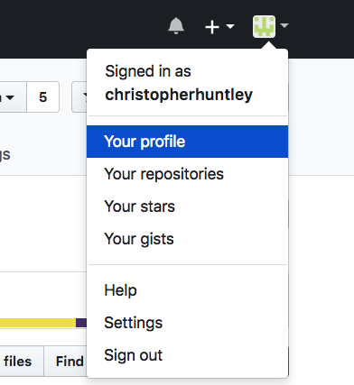
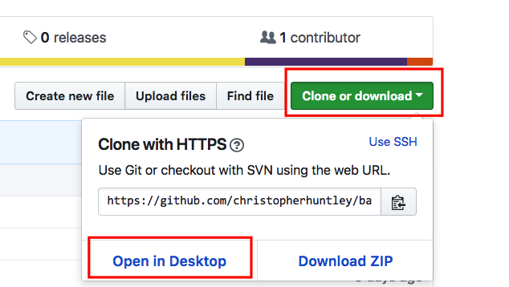
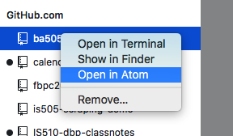
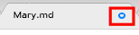
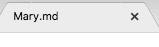
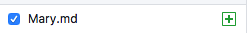
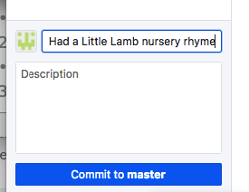
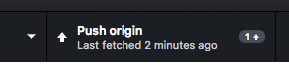
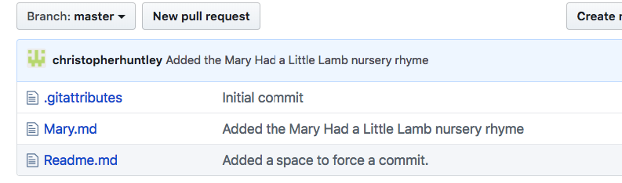

# BA 505 GitHub & Markdown Tutorial
__A quick introduction to Git with GitHub Desktop__

1. **If you have not done so, please complete the "Basic Workflow" chapter of DataCamp's "Introduction to Git for Data Science" course.** The course explains how to use basic Git commands from a terminal window. For now, you only need to complete the 'Basic Workflow' chapter, but you may want to complete the other chapters on your own as homework.   
2. **Click on the [GitHub Classroom Assignment Link](https://classroom.github.com/a/X6e0BLuN).** GitHub will 'fork' a copy of the `github-tutorial` repository from Dr. Huntley's GitHub account to your GitHub account. It is your copy, with full ownership permissions. The steps below will modify the files in the repository and publish the changes to GitHub.
3. **Open up GitHub Desktop,** which provides a nice graphical user interface for executing Git commands and syncing your repositories with the GitHub website.
4. **Make sure you are logged in to the same github account you are using for this class.**  
  
If you are in the wrong account then log out and log in accordingly.  
5. **Clone this repository from GitHub to your desktop.**  
  
GitHub Desktop will ask where you want to save the new folder on your hard drive. Choose the `IS505` folder. The repository folder will then appear under GitHub.com in GitHub Desktop.  
  
6. **Open the folder in Atom (or an equivalent text editor).**  
  
To open directly from GitHub Desktop, right-click on the repository name and select `Open in Atom`. If you don't have Atom installed or Windows is not cooperating with GitHub Desktop then open another editor (note: MS Word in not an editor! VS Code is pretty good though, and many prefer it to Atom) and navigate to your new repository folder.
7. **Inside your folder, create a new file called `Mary.md` and paste the following text:**  
  ```  
  # Mary Had a Little Lamb  
  Mary had a little lamb, little lamb,little lamb  
  Mary had a little lamb
  Whose fleece was white as snow.

  And everywhere that Mary went
  Mary went, Mary went,  
  Everywhere that Mary went  
  The lamb was sure to go.  

  He followed her to school one day, school one day, school one day  
  He followed her to school one day  
  Which was against the rules.  

  It made the children laugh and play,
  laugh and play, laugh and play,  
  It made the children laugh and play,  
  To see a lamb at school.

  And so the teacher turned it out,
  turned it out, turned it out,  
  And so the teacher turned it out,  
  But still it lingered near,  
  He waited patiently about,  
  ly about, ly about,
  He waited patiently about,  
  Till Mary did appear.

  "Why does the lamb love Mary so?"  
  love Mary so?" love Mary so?"  
  "Why does the lamb love Mary so?"  
  The eager children cried.  
  "Why, Mary loves the lamb, you know,"  
  lamb, you know," lamb, you know,"  
  "Why, Mary loves the lamb, you know,"  
  The teacher did reply.
  ```
  The text is written in Markdown, the text formatting language. GitHub helpfully parses `.md` files as Markdown and then renders them as web pages in your repository. If you have not already done so, plan to read through the [Markdown docs on GitHub](https://guides.github.com/features/mastering-markdown).  
8. **Before saving the file take note of the blue circle next to the filename at the top.**  
  
The circle is a "dirty file" indicator used to mark files with unsaved changes. If you are not using Atom, then you should see something similar for your editor (unless it is complete cr@p.)  
9. **Save the file and note that the dirty file indicator goes away.**  
  
Always look to make sure you don't have any dirty files before committing your changes in Git.  
10. **Switch back to GitHub Desktop, where you should see the new file listed as changed.**  
   
11. **Commit your changes with a `Summary` 'Added the Mary Had a Little Lamb nursery rhyme'.**  
  
12. **Push your changes to GitHub.**  
  
13. **Switch back to your browser and refresh the repository on GitHub.** Your new file should appear.  
  
14. **Open the `Mary.md` file on GitHub.com.** Oops. There is a typo on line 2. We missed a space after the second comma.  
15. **In GitHub Desktop, hit the Fetch Origin button** to make sure you have the latest copy on your computer. Note: `Push` syncs data to GitHub, while `Fetch` pulls data from GitHub. It's *always* good practice to pull down the latest changes from GitHub before editing a file.   
16. **In Atom, insert the missing space.** Don't forget to resave the file.  
17. **In GitHub Desktop, commit your changes (with the Summary comment 'Fixed a typo') and then Push/Sync to GitHub.** Refresh your browser window to make sure that your changes pushed to GitHub.  
18. **Open the `Readme.md` file edit the file as instructed.** You'll need to know how to use headlines and links in Markdown.  
19. **Commit and Push.** For the Summary comment say that you "Completed the tutorial."  
20. **Celebrate a little before moving on your homework.**
