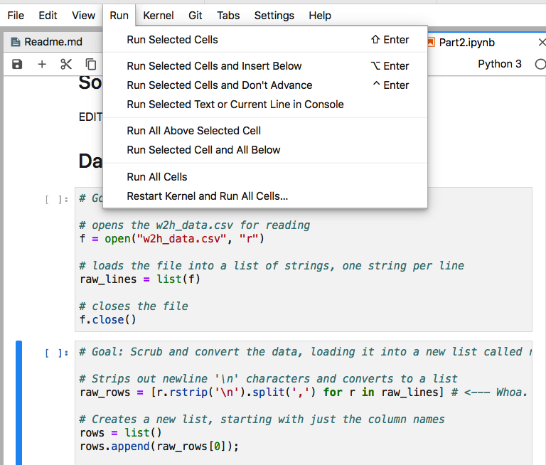

# The HealthStats Project

## Overview
This project is designed to provide Just-in-Time practice with Python, Jupyter, and GitHub. Each class period you will complete a short assignment that applies what you have learned that week. __Do not do assignments until they are assigned. They may change at any time until they are formally assigned.__

__You are encouraged to collaborate with your peers.__ However, you are also responsible for learning the key lessons of each assignment. So, if you need help, ask for it and pay attention to the answers. If you know how to help someone (without doing the work for them), then please help them out.

# Part 1: Lists & Control Flow
## Theory: You should know ...
* How to find and use [Markdown syntax](https://guides.github.com/features/mastering-markdown) for headlines, lists, links, etc.
* Rudimentary Python syntax, data types, and flow of control

## Practice: You be able to ...
* Write and render basic Markdown text
* Step through embedded Python code snippets
* Import data from an external file
* Perform calculations using the imported data

## Instructions
0. __Get the starter code.__ Use the following GitHub Classroom link to fork a copy of the code to your GitHub account.  
https://classroom.github.com/a/AoepiXrE  
Then clone your copy to your desktop and open in JupyterLab. 
1. __Take a few minutes to read about the [Waist to Hip Ratio](https://en.wikipedia.org/wiki/Waist%E2%80%93hip_ratio).__ You should understand it well enough to explain it to your parents and walk them through doing the analysis on themselves.
2. __Open the file `w2h_data.csv` and study the data in it, which is organized as a table in *comma separated value* (or CSV) format.__ A CSV file has data in rows and columns. Each line has the same columns in the same order, with each column separated from the next by a comma.  The first line has the column names (a.k.a. headings). The second line has the first row of data, with the next row below it, etc.  *We are going to use Jupyter to write a short report on Waist to Hip Ratios using examples from the `w2h_data.csv` file.*   
3. __Launch Jupyter from Anaconda and open the file `HealthStatsPart1.ipynb` from within this repository.__ All the notebook cells are already provided, with comments used to provide instructions. Try to read through the code and make sense of what each section of the notebook is about.
4. __Edit the Markdown cells with "EDIT THIS MARKDOWN CELL".__ Instructions are given in the HTML-style comments inside each cell. *You will find links to Markdown references in JupyterLab's Help menu.* 
5. __Read through the code cells, looking for "FIX THIS" comments indicating where you need to correct the code.__ For each, write the correct code, first making sure you understand what is required.
6. __Check your work by comparing with your peers.__ Just take care that your classmates may have also gotten the code wrong.
7. __Study the code again,looking for gems and dogpiles.__ You will be asked about these in the discussion questions.
8. __From the `Kernel` menu, use `Restart Kernel and Run All ...` to test your notebook.__ Fix any obvious errors and repeat until you think it is right. Save your notebook when you are done.
9. __Commit and sync your work to GitHub.__ For the commit summary comment use "Completed Part 1." Ask if you need help.
10. __Discussion Questions__
  * How long did it take you to figure out how to do a bullet list in Markdown? What other formatting tricks did you try?
  * Was there any code that you thought was particularly elegant? How about cryptic or buggy?
  * What does the code `raw_lines = list(f)` in the first code cell do exactly? Where can we learn more about loading files? Why do we bother closing the file at the end of the cell?
  * In the second code cell, why do we try to clean up the data all at once? Why not just deal with it as raw strings?
  * What is going on in the line below, also from the second code cell?  
  ```raw_rows = [r.rstrip('\n').split(',') for r in raw_lines]```
  * What does this do?  
  ```for raw_row in raw_rows[1:]:```
  * In the third code cell, a list is extended by another list. What does that mean and how is that different from appending list items to the list? How could we do the same thing using `append()`?
  * When might the calculation
  ```w2h_ratio = row[1]/row[2]``` give inaccurate results? How is this different in Python than in C/C++/Objective-C/Java/C#?

# Part 2: Dictionaries
## Theory: You should know ...
* How dictionaries are used for structured records
* How file operations work in Python

## Practice: You be able to ...
* Store and retrieve data from a dictionary
* Write a CSV file

## Instructions
1. __Open the `Part2.ipynb` file in Jupyter.__ The file already has the corrected Python code from the last class. Insert your Markdown from part 1 in the cells at the top. 
2. __Scroll down to (and select) the cell that starts with `# Goal: Scrub and convert the data`__ This cell uses a list for each row of the table. In practice we would not do it that way. It's too easy to mess up the column indexes when trying to interpret each row. Is the `Waist` in column 1 or column 2?
3. __From the `Run` menu, `Run All Above Selected Cell`.__ The markdown should render and the source data will be read from disk.  

4. __Modify the scrubbing code so that each row is stored as a dictionary instead of a list.__ The dictionary keys should be 'ID', 'Waist', 'Hip', and 'Gender'. The `rows` variable should have a *list of dictionaries* instead of a list of lists.
5. __In the Calculations section (a few cells down), modify the Python code so that it uses your the new dictionaries (instead of lists).__ You will need to know how to add the two new (key,value) pairs to each dictionary.
6. __Modify the Output section to use dictionaries instead of lists.__ You saw this coming, right?
7. __Now for a real challenge: Use Python to write the HTML table to a file called `StatsResults.html`.__ If you did this correctly, you should be able to open the file in a web browser and see the HTML table without Jupyter.
8. __Commit and sync your work to GitHub.__ For the commit summary comment use "Completed Part 2." 

# Part 3: NumPy Structured Arrays
## Theory: You should know ...
* How NumPy uses `dtype` to define structured arrays
* How NumPy element-wise operations work
* How NumPy input and output works

## Practice: You be able to ...
* Store and retrieve data from a NumPy structured array
* Read and write CSV files using NumPy

## Instructions
1. __Open the `Part3.ipynb` file in Jupyter.__ The file already has the corrected Python code from the last class. As before, fill in the first couple Markdown cells as asked. Yoiu can copy from previous versions if you like.
2. __Scroll down (and run) to the cell that starts with `# Goal: Extract the data from the file`__ Use NumPy's `genfromtxt()` function to read the file into the rows variable. You will need to supply a `dtype` that specifies the column names and data types. 
4. __Delete the cell that starts with `# Goal: Scrub and convert the data`.__ We don't need it anymore!  
5. __Scroll down to the cell that starts with `# Goal: for each row ...`__ Use NumPy to calculate arrays of waist-to-hip ratios and shape codes. (Use NumPy's element-wise operations for both of these. You should no longer need a for loop.) Then add columns to your rows array with the new data. Don't forget to do update the `dtype` for the array to include the new columns.  
6. __Use Python to write the results to disk.__ As before, write the data to an HTML table to a file called `StatsResults.html`. Then use NumPy's `savetxt()` function to write it to a CSV file called `StatsResults.csv`.
7. __Commit and sync your work to GitHub.__ For the commit summary comment use "Completed Part 3." 

# Part 4: Pandas DataFrames
## Theory: You should know ...
* How Pandas extends NumPy to provide better for support for structuring real world data
* How Pandas input and output works

## Practice: You be able to ...
* Create and populate Pandas DataFrames from
* Feed DataFrame data to NumPy
* Read and write CSV files using NumPy

## Instructions
1. __Open the `Part4.ipynb` file in Jupyter.__ The file already has the corrected Python code from class. Insert the missing markdown at the top as usual.
2. __Use Pandas's I/O functions to import the raw data from the CSV file.__ Make sure to use `dtype`s to name and type the columns while reading the file.
3. __For the calculations step, have NumPy use the data in the DataFrame.__ We covered several ways to get a NumPy array from Pandas in class. Store the new data in two new columns, without creating a DataFrame.
4. __Use DataFrame's I/O functions to present your results.__ Render the HTML for Jupyter and export to the CSV file `StatsResults.csv`.
5. __Commit and sync your work to GitHub.__ For the commit summary comment use "Completed Part 4." 
6. __Take a moment to assess.__  Compare your code to where we started in Part 1:  
    - Did it get longer or shorter? 
    - In places where it got longer, why did we choose to make it longer?
    - Does the notebook do more or less than before? 
    - Is it more or less complicated than before? 

# Part 5: A Large Data Set from Scratch
## Theory: You should know ...
* Numpy, Pandas, Matplotlib
* Markdown and Jupyter
* Basic descriptive analytics

## Practice: You be able to ...
* Create and lay out a new Jupyter Notebook
* Collaborate with your peers using Git/Github
* Use Pandas to load and manipulate a large dataset
* Use Numpy to analyze the numbers
* Use Matplotlib to plot key statistics

## Instructions
0. __Form a team of 2-3 people.__ Each team must have at least 2 people and no more than 3 people. Choose wisely as this is your tryout for the final projects. You will share a Git repo with your teammates through GitHub Classroom. The rest of the instructions assume that you are using `git pull`, `git commit` and `git push` continually to keep all of your copies in sync with your teammates. You may also want to keep personal "scrap" copies of your notebooks that you will assemble together at the end. That way you won't have to deal with multiple people editing the same file at once. (If you are really adventurous then you'll create separate git branches for each team member  and use git to merge them together on the master branch.)  
1. __Study the `ehresp_2-15.csv` and `EHResp2015.info.txt` files.__ The data was collected by the US Department of labor and includes various health stats from many thousands of people. Based on what you know, come up with 3 interesting research questions that you would like to test with the data.
2. __In your shared Git Repo, create a new Notebook called `EH_Study_2015.ipynb` in the same folder as your new data.__ Outline your study, including details like where the data came from, the key columns in the dataset, and what research questions you intend to study. Include the next step as a fourth research question.
3. __Load your data.__ Use a Pandas DataFrame called `source_data` with appropriate column names, data types,  and numerical indexes. Take care to ensure that your data loaded correctly before proceeding. You may want to keep your results separate from your source data, perhaps in a new DataFrame called `results`.
4. __Do an analysis of Body Mass Index data, comparing males with females.__ You will need to (re-)calculate BMI for each person and then display histograms segmented by one of the other attributes (income, exercise, soda consumption). If you can figure out how, display two histograms (one per segment) on one plot.
5. __Perform the rest of your analysis.__ Show your calculations and use plots to illustrate your results.
6. __Present your results in class.__ We will do this in the next class period.